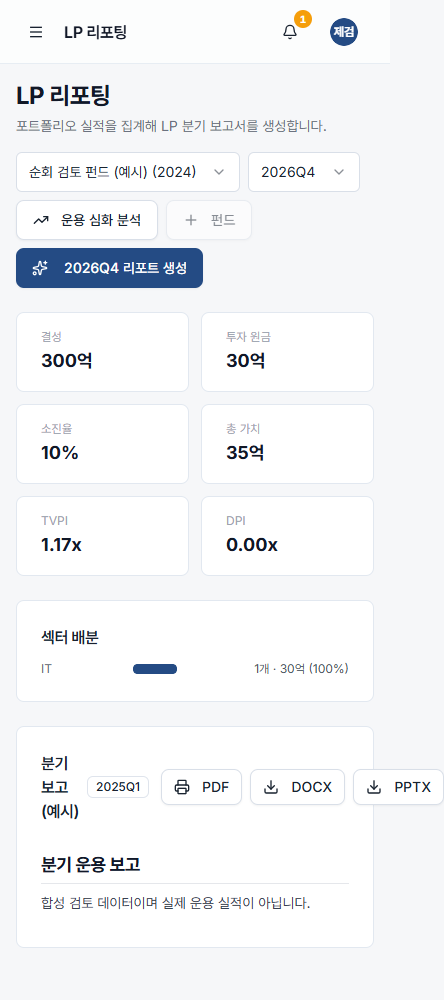
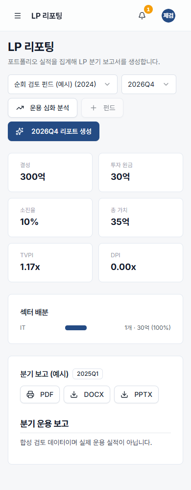
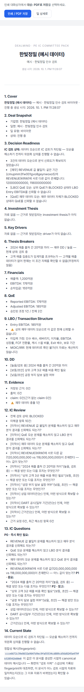

# 전체 사이트 검토 및 통합 배포 — 2026-10-01

## 실제 인수 상태

main `b919e5db52e1474dd245fdbb6fc9ddddf8587a8e`, 시작 HEAD `176cbbf2718583c3a88392bce206f2842680276e`.
새 로컬 branch `codex/site-review-release`. 기존 #119/#120/#122–#125의 누적 디자인/로그인/온보딩
변경을 인수했다. #121의 두 auth 파일은 #123과 중복하므로 별도 적용하지 않았다.
다른 agent 브랜치 수정/삭제, reset/clean/rebase/force-push 없음. 다른 환경의 미커밋 작업은 포함하지 않는다.
사용자가 기존 사이트 배포를 승인했다. 새 앱/DB/Vercel 프로젝트는 만들지 않는다.

## 순회 및 실제 수정

- 공개 7개 화면, 인증 21개 화면을 1440px/390px로 열었다.
- PE의 IC review/decision/workflow, committee pack, data room, financials, LBO 7개 탭을 두 크기로 열었다.
- 모바일 닫힌 메뉴의 숨김, Escape, focus return, 링크 이동, desktop resize를 확인했다.
  열린 메뉴에서 Tab 16회가 dialog 안에 머무는 것도 확인했다.
- 기존 build baseline 71항목 중 LP 모바일 가로 넘침/메뉴 Escape가 FAIL이었다.
  수정 dev build 75항목 PASS. 개발 중 발견한 PE 인쇄 hydration 오류도 재현 후 수정했다.
- LP: 제목·내보내기 영역을 모바일에서 쌓고 wrap, PDF 링크의 button 중첩도 정리했다.
- 메뉴: 기존 nav content를 Radix modal dialog에 재사용해 Escape/focus trap/return을 연결했다.
- PE 인쇄: 같은 committee pack의 generatedAt를 서버에서 표시 문자열로 전달한다.
  print toolbar/padding도 모바일에 맞췄다. 생성 시각 자체/markdown/fingerprint/snapshot은 바꾸지 않는다.

## canonical/API 경계

VC decision/memo/gate/contradiction은 기존 builder와 evidence API를 사용한다.
PE committee print는 서버의 동일 pack에서 본문·시각·fingerprint를 전달한다.
이번 수정은 레이아웃/표시/접근성으로 제한되며 새로운 계산/판정 엔진을 만들지 않는다.
누적 #123 로그인은 parameterized case-insensitive 조회와 모호한 기존 이메일 후보 거부를 포함한다.
권한/청구/한도/투자 승인 의미를 바꾸지 않는다. pricing/정책 불일치 목록은 승인 대기 그대로다.

## 환경 및 검증

정확한 로컬 SQLite `file:./dev.db`, synthetic 소유자 fixture만 생성·정리한다.
외부 브라우저 요청과 DART/AI/결제 mutation은 막고, 로컬 Speed Insights 자산만 명시적으로 stub한다.
운영 계측/AI/실제 청구 검증으로 해석하지 않는다. 기존 demo/로그인 검토 계정은 보존한다.
기존 3000 서버의 build를 덮어쓰지 않도록 `DEALMIND_LOCAL_REVIEW=1`이면 `.next-local-review` 사용,
기본 production dist는 `.next` 그대로다. 새 production env를 설정하지 않는다.

| 실제 명령/대상 | 결과 |
|---|---|
| npm.cmd run test:all | PASS exit 0 |
| npx.cmd tsc --noEmit | PASS exit 0 |
| npm.cmd run lint | PASS exit 0 |
| npm.cmd run test:site-review-e2e (localhost:3001 dev) | PASS 75항목 |
| npm.cmd run build (로컬 review dist) | PASS exit 0 |
| production build site/login/paid/PE-source E2E | NOT VERIFIED: 서버 시작 자동 검토 차단, 사용자 실행 대기 |
| 신규 통합 PR의 현재 head CI/운영 배포 | NOT VERIFIED: 준비 중 |
| 운영 인증 VC/PE, aliasError | NOT VERIFIED |

사이트 순회는 HTTP/Server Components 예외/가로 넘침/스크린샷과 지정된 메뉴 동작을 확인한다.
모든 업무 mutation/개별 역할/실제 운영 데이터/결제/AI를 전부 검증했다는 뜻은 아니다.
baseline과 dev 결과는 `development-result.json`, 원본 logs/screenshots는 ignored `screenshots/`에 있다.
배포용 서버 시작 자동 검토는 구체적 차단 이유를 제공하지 않았다. 기존 3000 서버는 보존했다.

## 남은 일

수정 production build E2E → 통합 PR/현 head CI → squash merge → 실제 운영 SHA/READY/alias/runtime 확인.
운영 DB/env/schema/결제 설정은 수정하지 않는다. 기존 누적 PR은 통합 후 다시 병합하지 않는다.
